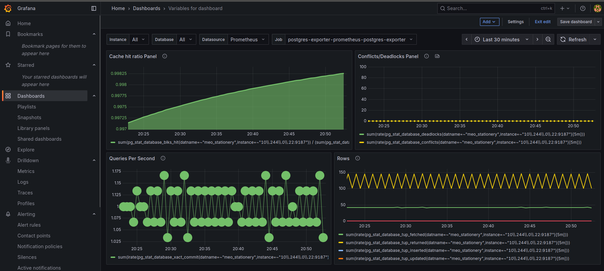

# Meo Stationery E-Commerce Platform 📝✏️

A modern, full-stack e-commerce platform for stationery products, built with Next.js, Prisma, and PostgreSQL. This project is designed to be deployed and orchestrated in a Kubernetes environment using Helm.

## ✨ Features

- 🛍️ **Product Catalog**: Browse products with categories and search functionality.
- 🛒 **Shopping Cart**: Real-time updates to the shopping cart.
- 📦 **Order Management**: System for tracking order status.
- 👤 **User Authentication**: User login and profile management.
- 💳 **Payment Integration**: VNPay gateway for payments.
- 📱 **Responsive Design**: Fully responsive UI with Tailwind CSS.
- 🎨 **Modern UI**: Modern UI components from Radix UI.
- 🐳 **Containerized**: Ready for deployment with Docker.
- ☸️ **Kubernetes Ready**: Configured for Kubernetes deployment.
- 📊 **Monitoring**: Full monitoring stack with Prometheus and Grafana.
- 🔍 **Database Metrics**: PostgreSQL monitoring with custom dashboards.

## 🛠️ Tech Stack

- **Framework**: Next.js (Frontend and Backend)
- **ORM**: Prisma
- **Database**: PostgreSQL
- **Containerization**: Docker
- **Orchestration**: Kubernetes
- **Deployment**: Helm
- **Monitoring**: Prometheus + Grafana
- **Database Monitoring**: PostgreSQL Exporter

## 🚀 Getting Started (Local Development)

To get a local copy up and running, you can use Docker Compose.

1.  **Clone the repository:**
    ```bash
    git clone https://github.com/minhtri1612/meo_station.git
    cd meo_station
    ```

2.  **Start the services:**
    This will start the application and a PostgreSQL database.
    ```bash
    docker compose up -d
    ```

3.  **Access the application:**
    Open your browser and navigate to `http://localhost:3000`.

4.  **View logs:**
    ```bash
    docker compose logs -f
    ```

5.  **Stop the services:**
    ```bash
    docker compose down
    ```

## 🚀 Deployment (Kubernetes)

This application is designed to be deployed to a Kubernetes cluster using Helm.

1.  **Prerequisites:**
    - A running Kubernetes cluster.
    - `kubectl` configured to connect to your cluster.
    - Helm v3 installed.

2.  **Navigate to the Helm chart directory:**
    ```bash
    cd k8s_helm/backend
    ```

3.  **Deploy the application:**
    This command will deploy the application and a PostgreSQL database to your Kubernetes cluster.
    ```bash
    helm install backend . --namespace meo-stationery --create-namespace
    ```

4.  **Check the status of the deployment:**
    ```bash
    kubectl get all -n meo-stationery
    ```

5.  **Access the application:**
    If you are using a local Kubernetes cluster (like Minikube or Docker Desktop), you can use `port-forward` to access the application:
    ```bash
    kubectl port-forward svc/backend-meo-stationery-backend 8080:80 -n meo-stationery
    ```
    Then, open your browser and navigate to `http://localhost:8080`.

6.  **Uninstall the deployment:**
    ```bash
    helm uninstall backend -n meo-stationery
    ```

## 📊 Monitoring & Observability

This project includes a complete monitoring stack with Prometheus and Grafana for comprehensive observability of your application and database performance.

### 🎯 **Monitoring Features**

- **📈 Application Metrics**: Real-time monitoring of your Next.js application
- **🗄️ Database Monitoring**: PostgreSQL performance metrics and health checks
- **🚀 GitOps Integration**: Monitoring deployed via ArgoCD for automated management
- **🌐 Web Access**: Fast web interfaces (no port-forwarding needed!)

### 🛠️ **Monitoring Stack Components**

1. **Prometheus**: Metrics collection and storage
2. **Grafana**: Visualization and dashboards
3. **PostgreSQL Exporter**: Database-specific metrics
4. **NGINX Ingress**: Fast web access to all monitoring tools

### 🌐 **Access Monitoring Dashboards**

After deploying with our GitOps setup, access your monitoring via web URLs:

- **🏪 Meo Stationery App**: http://meo-stationery.local
- **📊 Grafana Dashboards**: http://grafana.local  
- **🔍 Prometheus Metrics**: http://prometheus.local

**Login Credentials:**
- **Grafana Username**: `admin`
- **Grafana Password**: `prom-operator`

### 📈 **Database Monitoring Dashboard**



Our custom PostgreSQL dashboard provides comprehensive database monitoring including:

- **Cache Hit Ratio**: Database cache efficiency (>99% indicates healthy performance)
- **Queries Per Second**: Real-time database query load
- **Conflicts/Deadlocks**: Database concurrency monitoring  
- **Database Rows**: Track data growth and activity trends

### 🚀 **Quick Start Monitoring**

1. **Start your environment:**
   ```bash
   minikube start
   ```

2. **Wait for all services to start** (1-2 minutes)

3. **Access dashboards directly in browser:**
   - Application: http://meo-stationery.local
   - Monitoring: http://grafana.local

### 🔧 **Monitoring Architecture**

```
┌─────────────────┐    ┌──────────────────┐    ┌─────────────────┐
│   PostgreSQL    │────│ PostgreSQL       │────│   Prometheus    │
│   Database      │    │ Exporter         │    │   (Metrics)     │
└─────────────────┘    └──────────────────┘    └─────────────────┘
                                                         │
┌─────────────────┐    ┌──────────────────┐    ┌─────────────────┐
│   Next.js       │────│ NGINX Ingress    │    │    Grafana      │
│   Backend       │    │ (Web Access)     │    │ (Dashboards)    │
└─────────────────┘    └──────────────────┘    └─────────────────┘
```

### 📝 **Key Monitoring Metrics**

**Application Metrics:**
- Request rate and response times
- Error rates and status codes  
- Resource utilization (CPU, Memory)

**Database Metrics:**
- Connection count and query performance
- Cache hit ratios and index usage
- Database size and growth trends
- Lock conflicts and deadlock detection

**Infrastructure Metrics:**
- Pod health and restart counts
- Network traffic and ingress performance
- Storage utilization and I/O metrics